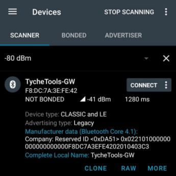

En este manual se recopilan un conjunto de pruebas y procedimientos que se pueden utilizar para comprobar y/o solucionar los problemas más comunes en Heimdall.

Índice:

[TOC]


# Autossh

## ¿Se inicia autossh al arrancar?
Comprobar que el inicio del script `autossh.sh` está incluido en el  `crontab`. Para ello, ejecutar:

```bash
root@imx7-var-som:~ $ crontab -l
```

Comprobar que la tarea se encuentra en el `crontab` del usuario:

```bash
@reboot /usr/bin/tmux new-session -d -s autossh /home/root/autossh.sh
```

## ¿Ha ocurrido algún error con Autossh?
Comprobar el log de Autossh:

```bash
root@imx7-var-som:~ $ tmux a -t autossh
try to connect...
```

Si se observa algún problema, reiniciar el programa de Autossh:

```bash
root@imx7-var-som:~ $ ./autossh.sh
```

## ¿Se puede realizar una conexxión desde el servidor?
Comprobar que es posible conectarse desde el servidor:

```bash
ubuntu@ip-172-31-35-35:~ $ ssh -p <PORT> root@localhost
```


# Bluetooth

## ¿Se inicia Bluetooth Config Server al arrancar?
Comprobar que el inicio del `ble_config_server` está incluido en el  `crontab`. Para ello, ejecutar:

```bash
root@imx7-var-som:~ $ crontab -l
```

Comprobar que la tarea se encuentra en el `crontab` del usuario:

```bash
@reboot sleep 10; /usr/bin/ble_config_server start
```

## ¿Está corriendo Bluetooth Config Server?
Comprobar que el proceso del Bluetooth Config Server existe:

```bash
root@imx7-var-som:~ $ ps aux | grep ble_config_server
root       553  0.0  1.4  35668 15220 ?        Sl   12:07   0:00 /usr/bin/python3 /usr/bin/ble_config_server start
```

Comprobar que el Heimdall está realizando advertising. Para ello, utilizar la aplicación [NRF Connect](https://www.nordicsemi.com/Products/Development-tools/nRF-Connect-for-mobile), iniciar un escaneo y comprobar que el dispositivo con nombre `Tychetools-GW` se está anunciando.



## ¿Ha ocurrido algún error en Bluetooth Config Server?
Comprobar el log de Bluetooth Config Server:

```bash
root@imx7-var-som:~ $ tail -f .ble_config_server.log
```

Para reiniciar el Bluetooth Config Server, ejecutar el siguiente comando:

```bash
root@imx7-var-som:~ $ ble_config_server restart
```

## Otras consideraciones
- ¿Está instalado Bluetooth Config Server?

Bluetooth Config Server se puede instalar descargando el [repositorio](https://bitbucket.org/tychetools/ble_config_server/src/master/) y ejecutando el siguiente comando:

```bash
root@imx7-var-som:~/ble_config_server $ pip3 install .
```

- ¿Está la antena Bluetooth conectada?

Comprobar que la antena está adecuadamente conectada al Heimdall y que el pigtail no está defectuoso.


# Bluetooth Mesh

## ¿Hay comunicación con el nrf52?
Para comprobar que hay comunicación con el nrf52, usar `OpenOCD` para resetear el microcontrolador.

Para ello, crear un fichero `reset.cfg` con la siguiente forma:

```
source [find interface/imx-native.cfg]
transport select swd
source [find target/nrf52.cfg]

imx_gpio_peripheral_base 0x30230000
imx_gpio_swd_nums 12 13

init
targets
reset
exit
```

A continuación, ejecutar el siguiente comando y comprobar que no aparece ningún mensaje de error:

```bash
root@imx7-var-som:~ $ openocd -f reset.cfg || echo "FAILED!"
```

## ¿Se puede provisionar/configurar un nodo correctamente?
Para comprobar que la comunicación Bluetooth Mesh está funcionando correctamente, se puede provisionar un nodo y comprobar que se configura adecuadamente.

Para ello, un posible procedimiento podría ser:

1. Iniciar la aplicación y realizar un escaneo

```bash
root@imx7-var-som:~ $ ttdaemon start
root@imx7-var-som:~ $ ttcli
```
```
Welcome to the TycheTools Gateway shell. Type help to list commands.

#gateway> gateway init
Gateway started succesfully
#gateway> gateway start_scan
```

2. Abrir el log de la aplicación:

```bash
root@imx7-var-som:~ $ ttlog
```

3. Programar un nodo con el FW [fw-iris](https://bitbucket.org/tychetools/fw-iris/src/devel/).

4. Comprobar que el nodo se provisiona y configura correctamente. Para ello, se puede observar el LED de estado del nodo y el log de la aplicación abierto previamente.


# Comunicación 4G

## ¿Se inicia y configura el SIM7600 correctamente?
(script?)

## ¿Hay suficiente cobertura?

## ¿Se reciben los paquetes de _ping_?
Para comprobar que hay conexión a Internet, se puede emplear la utilidad `ping` añadiendo como parámetro la interfaz 4G:

```bash
root@imx7-var-som:~ $ ping -I wwan0 8.8.8.8
```

## ¿Ha ocurrido algún error con el SIM7600?
(log?)


# Conexión serie (USB UART)

## ¿Se puede realizar una conexión por UART?

Para comprobar la conexión serie, conectar un cable Micro-USB al puerto USB-UART del Heimdall. Desde el otro dispositivo, ejecutar el programa `minicom` con el siguiente comando:

```bash
$ minicom -b 115200 -D /dev/ttyUSB0
```

__NOTA:__ Asegurarse de que el `Hardware Flow Control` está deshabilitado. Esto puede hacerse desde la configuración `Serial port setup` de `minicom`.


# Gateway app

## ¿Se inicia el demonio al arrancar?
Comprobar que el inicio del `ttdaemon` está incluido en el  `crontab`. Para ello, ejecutar:

```bash
root@imx7-var-som:~ $ crontab -l
```

Comprobar que la tarea se encuentra en el `crontab` del usuario:

```bash
@reboot /home/pi/.local/bin/ttdaemon start
```

## ¿Está el demonio corriendo?
Comprobar que el proceso del Bluetooth Config Server existe:

```bash
root@imx7-var-som:~ $ ps aux | grep ttdaemon
root       553  0.0  1.9  30480 19892 ?        S    10:48   0:00 /usr/bin/python3 /usr/bin/ttdaemon start
```

Si no estuviera iniciado, para hacerlo ejecutar:

```bash
root@imx7-var-som:~ $ ttdaemon start
```

## ¿Está el gateway inicializado?
Comprobar que el gateway está inicializado. Para ello ejecutar:

```bash
root@imx7-var-som:~ $ ttcli gateway status
Gateway not initialized
```

Para inicializarlo, ejecutar:

```bash
root@imx7-var-som:~ $ ttcli gateway init
```

## ¿Están las aplicaciones habilitadas?
Comprobar que las aplicaciones están habilitadas o deshabilitadas. Para ello ejecutar:

```bash
root@imx7-var-som:~ $ ttcli app list
backend:        Disabled
air_quality:    Disabled
snmp:           Disabled
```

Para habilitar una aplicación, ejecutar:

```bash
root@imx7-var-som:~ $ ttcli app enable <APP_NAME>
```

_Ejemplo:_

```bash
root@imx7-var-som:~ $ ttcli app enable backend
```

## ¿Está la aplicación configurada correctamente?
Comprobar que el fichero de configuración de la aplicación `gw.config` tiene todos los parámetros necesarios (url, compañia, usuario, etc.):

```bash
root@imx7-var-som:~ $ cat .tychetools/gw.config
```

## ¿Está el `gwrc` creado?
Comprobar que el fichero `gwrc` está creado en el directorio `.tychetools` y contiene los comandos que deben ejecutarse al iniciar la aplicación.

```bash
root@imx7-var-som:~ $ cat .tychetools/gwrc
```

_Ejemplo: Contenido de_ `gwrc`
```bash
gateway init
app enable backend
```


# LEDs

## ¿Funcionan todos los LEDs?
Para verificar el funcionamiento de los LEDs, ejecutar el script de Python `leds_test.py` que se encuentra en el repositorio [heimdall_hwm](https://bitbucket.org/tychetools/gw-misc/src/master/heimdall_hwm/):

```bash
root@imx7-var-som:~/gw-misc/heimdall_hwm $ python3 leds_test.py
```

Comprobar que tanto el LED del Heimdall como los LEDs del frontal se encienden intermitentemente. El LED del Heimdall debe ser de color blanco (RGB).


# USB

## ¿Se detectan conexiones USB?

Para comprobar que el Heimdall detecta conexiones USB, ejecutar el siguiente comando:

```bash
root@imx7-var-som:~ $ dmesg -w
```

A continuación, conectar un periférico al puerto USB del Heimdall y comprobar que se reciben mensajes relacionados con el USB.

_Ejemplo:_

```
[ 5744.907843] usb 1-1.4: new low-speed USB device number 10 using xhci_hcd
[ 5745.041629] usb 1-1.4: New USB device found, idVendor=046d, idProduct=c31c, bcdDevice=64.00
[ 5745.041632] usb 1-1.4: New USB device strings: Mfr=1, Product=2, SerialNumber=0
[ 5745.041634] usb 1-1.4: Product: USB Keyboard
[ 5745.041635] usb 1-1.4: Manufacturer: Logitech
```


# Watchdog
El kernel de Linux puede reiniciar el sistema si se detecta algún problema. La configuración del watchdog se realiza desde el archivo `/etc/watchdog.conf`.

## ¿Se inicia el watchdog al arrancar?
Para iniciar el watchdog al arrancar el sistema, comprobar que fichero `/etc/default/watchdog` incluye la siguiente línea:

```bash
# Start watchdog at boot time? 0 or 1
run_watchdog=1
```

## ¿Cuánto tarda en arrancar el watchdog desde el arranque?
Es conveniente que el watchdog comience a funcionar unos minutos después de que el sistema haya arrancado para que este no entre en _bootloop_.

Comprobar que el archivo de configuración `/etc/watchdog.conf` incluye las siguientes líneas:

```bash
watchdog-timeout = 300
```

## ¿Se comprueba que hay conexión a Internet?
Comprobar que el archivo de configuración `/etc/watchdog.conf` incluye las siguientes líneas:

```bash
retry-timeout = 600
ping = 8.8.8.8
```

Para probarlo, se puede forzar la desconexión y comprobar que el sistema se reinicia al cabo de unos minutos.

_Ejemplos: link down_
```bash
root@imx7-var-som:~ $ ip link set dev eth0 down
```
```bash
root@imx7-var-som:~ $ ip link set dev wwan0 down
```

## ¿Se comprueba que el sistema se ha congelado?
Comprobar que el archivo de configuración `/etc/watchdog.conf` incluye la siguiente línea:

```bash
max-load-5 = 18
```

Para probarlo, se puede forzar el congelado y comprobar que el sistema se reinicia al cabo de unos minutos.

_Ejemplo: Bomba fork_
```bash
root@imx7-var-som:~ $ bomb(){ bomb|bomb& };bomb
```

## ¿Se comprueba que la aplicación está funcionando?
El script `ttwatchdog` realiza las siguientes comprobaciones:

- Error de conexión UART con microcontrolador
- Servidor socket `ttgw` no está corriendo
- Error desconocido

Comprobar que el watchdog incluye el script en el fichero de configuración `/etc/watchdog.conf`:

```bash
test-binary             = /home/root/gw-app/scripts/ttwatchdog
test-timeout            = 60
```

Para probarlo, se pueden forzar errores y comprobar que el sistema se reinicia al cabo de unos minutos.

_Ejemplo: Parar el Nordic del Heimdall_
```bash
root@imx7-var-som:~ $ JLinkExe -if SWD -speed 4000 -device NRF52840_XXAA -autoconnect 1
J-Link>h
```

## Otras consideraciones
Comprobar que el archivo de configuración `/etc/watchdog.conf` incluye las siguientes líneas:

```bash
watchdog-device = /dev/watchdog
interval = 10

realtime = yes
priority = 1
```

# WiFi

## ¿Se realiza un escaneo correctamente?
Comprobar que se encuentran redes inalámbricas disponibles ejecutando el siguiente comando:

```bash
root@imx7-var-som:~ $ iw dev wlan0 scan | grep SSID
```

## ¿Se conecta correctamente a la red WiFi?
Para verificar que el Heimdall se conecta a una red WiFi correctamente, ejecutar el script de [tt-var-wifi.sh](https://bitbucket.org/tychetools/gw-misc/src/master/rpi_deployment/tt-var-wifi.sh) del repositorio [gw-misc](https://bitbucket.org/tychetools/gw-misc/src/master/):

```bash
root@imx7-var-som:~/gw-misc/rpi_deployment $ ./tt-var-wifi.sh
```
