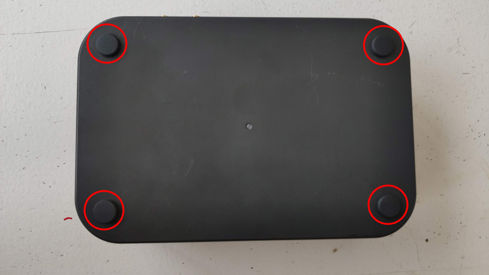
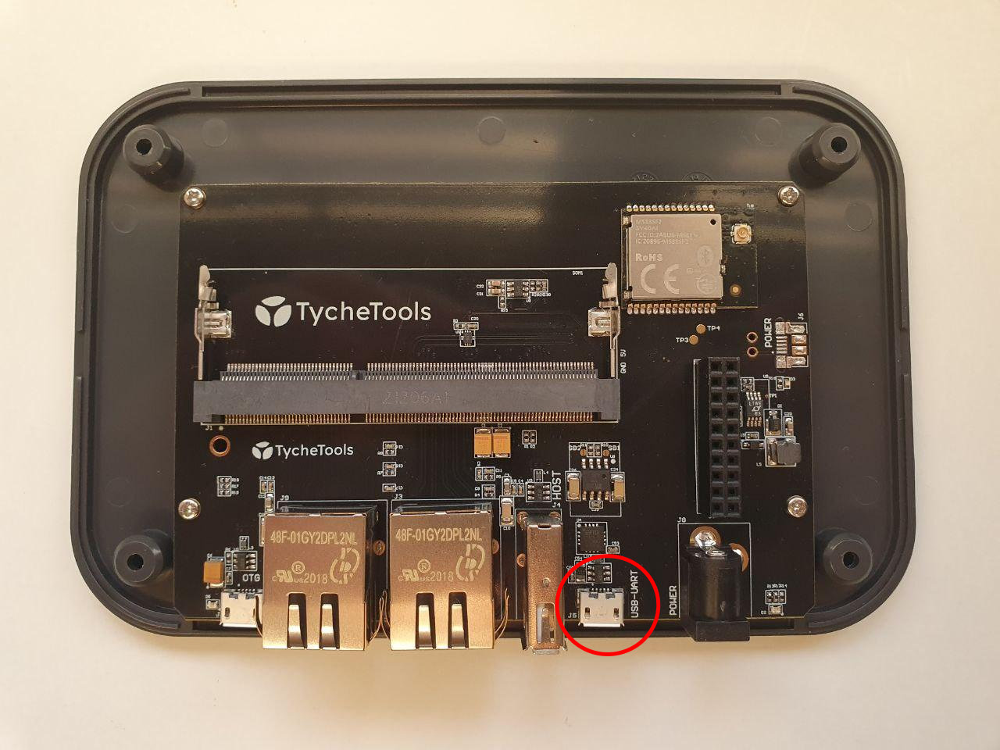
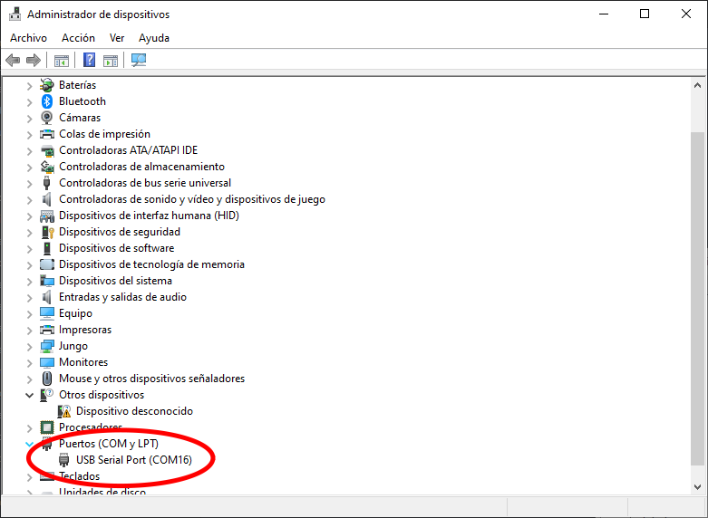
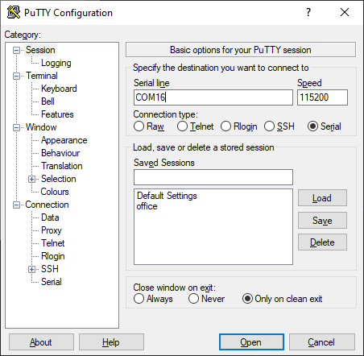
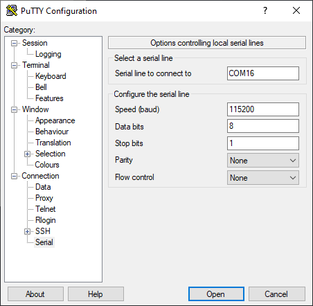
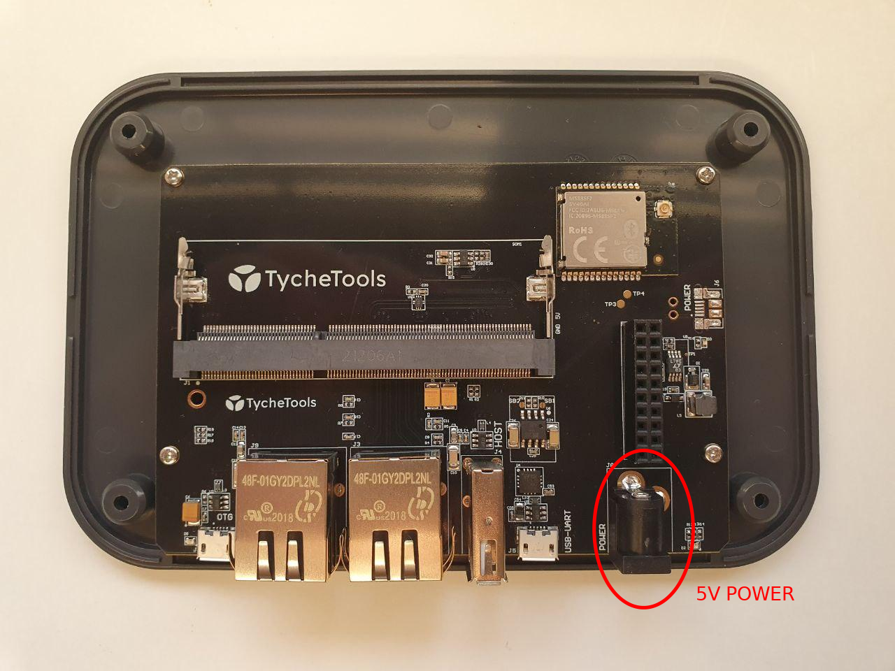
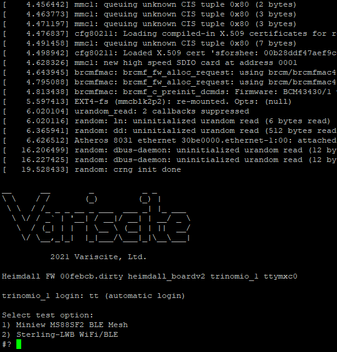
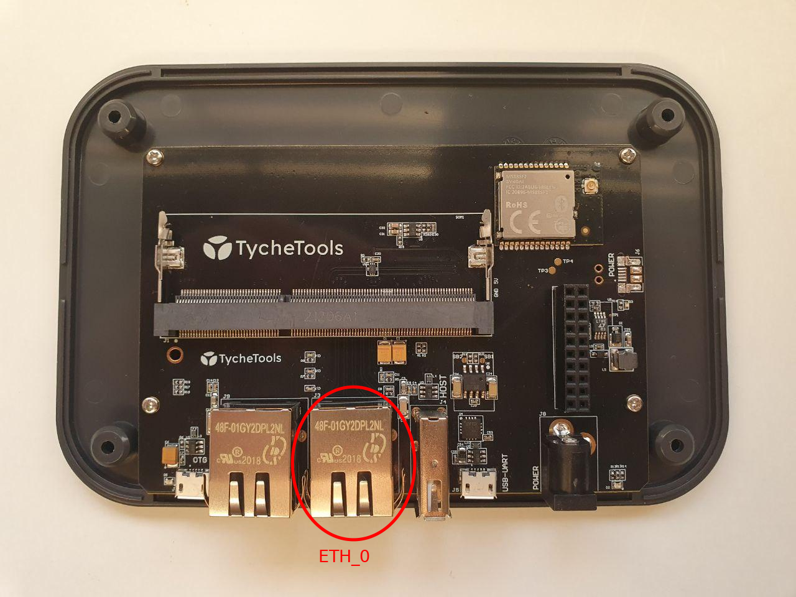

# Heimdall Radio Test

Esta carpeta contine los archivos y documentación necesaria para ejecutar los test de radio en un Heimdall.

## Setup

El Heimdall que se vaya a usar para las pruebas de radio debe ser específico para esas pruebas, por lo que hay que realizar unos cambios en el sistema operativo que deshabilitan el comportamiento normal y permiten las funciones de radio test.

Primero se debe configurar el sistema de archivos como lectura/escritura: `sudo mount -o remount,rw /dev/mmcblk2pX`.

Ahora borraremos todos los archivos referentes a _ttgateway_ y a _ttbleserver_ en `/etc/rcX.d` para evitar que se ejecuten automáticamente:

```
rm /etc/rc*/*ttgateway
rm /etc/rc*/*ttbleserver
```

También se debe desactivar la interfaz WiFi del archivo `network/interfaces` si estuviera activada.

Posteriormente, debemos instalar el nuevo firmware del módulo Wifi/BLE:

```
tar -axf regCypress-arm-eabihf-8.2.0.16.tar.bz2
cp regCypress-arm-eabihf-8.2.0.16/brcmfmac43* /lib/firmware/brcm/
cd /lib/firmware/brcm/
mv brcmfmac4339-sdio.bin brcmfmac4339-sdio-prod.bin
mv brcmfmac43430-sdio.bin brcmfmac43430-sdio-prod.bin
ln -s brcmfmac4339-sdio-mfg.bin brcmfmac4339-sdio.bin
ln -s brcmfmac43430-sdio-mfg.bin brcmfmac43430-sdio.bin
cd -
```

También debemos instalar el firmware de radio test al módulo de Miniew con OpenOCD: `openocd -f nordic_test.conf`.

Si la board de Heimdall fuera distinta a `heimdall_boardv2` se debería volver a compilar _gw-firmware_ para el hardware correspondiente y usar ese firmware.

Por último, debemos configurar la terminal por UART para que muestre la interfaz CLI de radio test en lugar de bash. Primero hay que copiar la carpeta `bin` a `/home/root`: `cp -r bin /home/root`, posteriormente, hay que modificar dos archivos del sistema:

En `/etc/passwd/` cambiar:
```
tt:x:1000:1000::/home/tt:/bin/bash
```
por
```
tt:x:1000:1000::/home/tt:/home/root/bin/psterm.sh
```

Y en `/bin/start_getty` cambiar:
```
${setsid:-} ${getty} -L $1 $2 $3
```
por
```
${setsid:-} ${getty} -a tt -L $1 $2 $3
```


Al reiniciar ya tendremos el sistema de radio test activado y podremos interactuar con el a través de la interfaz UART del Heimdall.


Tras estos pasos, no se debe actualizar este Heimdall mediante _swupdate_ ya que se perderían todos los cambios realizados.

## Usage

Para realizar la configuración de los dispositivos Sterling LWB y Minew MS88SF81 es necesario usar diversas utilidades del sistema Linux.
Para evitar problemas y disponer de un entorno más seguro y consistente, estas utilidades se han hecho accesibles a través de un programa de configuración disponible a través del puerto USB del dispositivo.

Para acceder al puerto USB interno y a las conexiones de las antenas es necesario sacar el Heimdall de su caja de plástico, para lo cual se deben retirar los cuatro tornillos señalados en la siguiente imagen:



Para acceder a esta interfaz de comunicación solo es necesario un ordenador con un puerto USB disponible.

Para alimentar el equipo, es necesario disponer de una fuente de alimentación adecuada con las siguientes características:

 - Salida a 5VDC con hasta 2A
 - Conector Jack 5.5x2.1 mm con centro positivo
 
 Un ejemplo de fuente de alimentación adecuada es la [SWI15-5-E-P5](https://www.mouser.es/ProductDetail/CUI-Inc/SWI15-5-E-P5?qs=sGAEpiMZZMvasLKgtn5bIdlT96xMCNovT%252Bc0acQDhYxII2oQsZ%2FYHg%3D%3D)

### Connection

La conexión con el dispositivo es de tipo serial a través de un puerto USB.
Es posible conectarse a el a través de muchos programas que ofrecen esta funcionalidad, por ejemplo, Putty, el cual puede ser descargado desde [este enlace](https://www.chiark.greenend.org.uk/~sgtatham/putty/latest.html).

Antes de comenzar es necesario que Putty sea descargado e instalado en el ordenador que se va a utilizar si no lo estuviese ya.
También es necesario asegurarse de que el equipo Heimdall está apagado (desenchufado) y no tiene ningún otro cable conectado a ninguno de sus puertos.

Los pasos para realizar la conexión utilizando Putty son los siguientes:

 1. Usaremos el cable USB a Micro USB para conectar el ordenador con el Heimdall tal y como se muestra en la siguiente imagen:



 2. Abriremos el Administrador de dispositivos de Windows para comprobar nombre de puerto que fue asignado al equipo, como se puede ver en la imagen siguiente:



 3. Abrimos Putty y seleccionamos el tipo de conexión a "Serial". Introduciremos el nombre asignado al puerto de comunicación en el recuadro "Serial line" y 115200 en el recuadro "Speed".



 4. Accederemos al apartado de configuración del puerto serie de Putty haciendo clic en Connection&gt;Serial y comprobaremos que la configuración es correcta. Los parámetros deben ser los mismos que los que aparecen en la siguiente imagen, si no fuesen así los cambiaríamos para que coincidan:



 5. Finalmente haremos click en open y una ventana negra vacía se abrirá en el ordenador. Posteriormente, alimentaremos el Heimdall a través de su conector de alimentación:



 Tras unos segundos, debería aparecer en nuestra pantalla un menú similar al mostrado a continuación, indicando que el equipo ya está preparado para ejecutar comandos.



Si el menú no apareciera o hubiera algún otro problema o error, diríjase al final de este documento para recibir ayuda de TycheTools.


### BLE Mesh: Minew MS88SF81

Para acceder a la CLI de configuración del Minew MS88SF81 escribiremos el número correspondiente (1) y presionaremos &lt;ENTER&gt;.
Nos aparecerá una interfaz de linea de comandos para configurar la radio del módulo.

Esta interfaz implementa los comandos del [Ejemplo de Radio Test de Nordic](https://infocenter.nordicsemi.com/index.jsp?topic=%2Fcom.nordic.infocenter.sdk5.v15.2.0%2Fnrf_radio_test_example.html).

Los comandos disponibles son los siguientes:

| Command 	                   | Argument           | Description                                                              |
| ---------------------------- | ------------       | ------------------------------------------------------------------------ |
|cancel                        |                    | Cancel the last command.                                                 |
|data_rate                     | &lt;sub_cmd&gt;    | Set the data rate.                                                       |
|end_channel                   | &lt;channel&gt;    | End the channel for the sweep.                                           |
|output_power                  | &lt;sub_cmd&gt;    | Output power set.                                                        |
|parameters_print              |                    | Print current delay, channel, and other parameters.                      |
|print_rx                      |                    | Print the received RX payload.                                           |
|print_tx                      |                    | Print the TX buffer.                                                     |
|start_channel                 | &lt;channel&gt;    | Start channel for sweep or channel for constant carrier.                 |
|start_duty_cycle_modulated_tx | &lt;duty_cycle&gt; | Duty cycle in percent (two decimal digits, between 01 and 99).           |
|start_rx                      |                    | Start RX.                                                                |
|start_rx_sweep                |                    | Start the RX sweep.                                                      |
|start_tx_carrier              |                    | Start the TX carrier.                                                    |
|start_tx_modulated_carrier    |                    | Start the modulated TX carrier.                                          |
|start_tx_sweep                |                    | Start the TX sweep.                                                      |
|time_on_channel               | &lt;time&gt;       | Time on each channel (between 1 ms and 99 ms).                           |
|toggle_dcdc_state             | &lt;state&gt;      | Toggle DC/DC converter state.                                            |
|transmit_pattern              | &lt;sub_cmd&gt;    | Set transmission pattern.                                                |
|connect                       | [pkt_period]       | Start sending connection packets. Default period: 1000ms                 |
|listen                        |                    | Start listening for connections.                                         |
|print_state                   |                    | Print the state of the radio peripheral.                                 |
|sleep                         | &lt;time&gt;       | Send a packet and sleeps for a given time.                               |

Para más información consulte la documentación del [Ejemplo de Radio Test de Nordic](https://infocenter.nordicsemi.com/index.jsp?topic=%2Fcom.nordic.infocenter.sdk5.v15.2.0%2Fnrf_radio_test_example.html) o dirijase al final de este documento para recibir ayuda de TycheTools.


### Wi-Fi/BLE: Sterling LWB

Para acceder a la CLI de configuración del módulo Sterling LWB escribiremos el número correspondiente (2) y presionaremos  &lt;ENTER&gt;.
Nos aparecerá una interfaz de linea de comandos para ejecutar el comando `wl` proporcionado por el fabricante del módulo.

Todos los comandos ejecutados deben comenzar por `wl` seguido de los parámetros o argumentos que deseemos introducir. Por ejemplo, el comando `wl ver` muestra la información de versión del módulo.

Para obtener información sobre las funcionalidades de esta utilidad y sobre como usarla para ejecutar pruebas, consulte la [guia de certificación del fabricante](https://www.lairdconnect.com/documentation/sterling-lwb-certification-guide).

### Stop or restart the process

Si en cualquier momento deseamos volver al menú principal para volver a seleccionar una utilidad podemos hacerlo presionando la combinación de teclas `CTRL+C`.
Sin embargo, para empezar una nueva prueba es recomendable apagar y encender el dispositivo (desconectando la alimentación y volviéndola a conectar) para reinicializar el estado interno del equipo y de los módulos de radio.

### Getting help

Para obtener ayuda de TycheTools, puede ponerse en contacto mediante la dirección de email <hw@tychetools.com>.
Para que se pueda dar soporte, es necesario que se conecte el dispositivo a internet, lo que permite establecer una sesión de depuración remota, para ello, es suficiente con conectar el puerto ETH0 del equipo a una red con conectividad a internet, como se muestra en la siguiente imagen:


